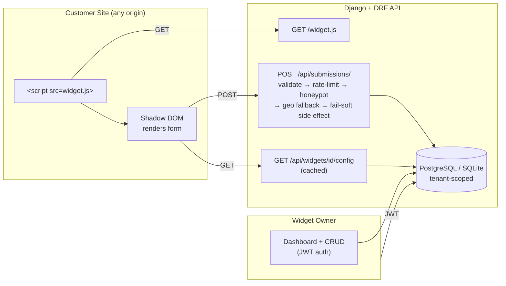

# FlyRank Capstone — Embeddable Widget & Lead-Capture Platform

A backend platform that lets a tenant create embeddable lead-capture widgets, get a
one-line `<script>` snippet, and safely collect submissions from any website that embeds
it — validated, rate-limited, spam-filtered, geo-enriched, and visible in a dashboard.

## Table of Contents

- [Architecture](#architecture)
- [Tech Stack](#tech-stack)
- [Run It](#run-it)
- [Seed / Demo Data](#seed--demo-data)
- [Try the Cross-Origin Embed](#try-the-cross-origin-embed)
- [Run Tests](#run-tests)
- [Design Decisions](#design-decisions)
- [Limitations](#limitations-honest-by-design)
- [AI Usage](#ai-usage)

## Architecture



**Apps**: `accounts` (tenant + auth), `widgets` (CRUD + public config), `submissions`
(hardened public intake), `dashboard` (tenant-scoped stats).

**Tenant isolation**: every query touching widgets/submissions is scoped through a
single shared helper (`accounts.utils.get_tenant_for_user`) — proven by automated tests,
not just code review.

**CORS**: split by path, not by origin allow-list. `/widget.js`, `/api/widgets/{id}/config/`,
and `/api/submissions/` are open to any origin (required — customer sites are unknown in
advance). All other endpoints (auth, CRUD, dashboard) get no CORS headers, so browsers
block cross-origin JS from reading their responses even with a leaked token.

## Tech Stack

| Layer | Choice | Why |
|---|---|---|
| Language / Framework | Python, Django + DRF | Comparable skillset to the brief's suggested stack — validation, CORS, throttling all first-class |
| Auth | JWT (`djangorestframework-simplejwt`) | Stateless — fits a public-facing, cross-origin API better than session auth |
| Database | PostgreSQL (Docker) / SQLite (local dev) | Postgres in prod-like environment; SQLite kept for fast local iteration |
| Rate limiting | DRF built-in throttling | No extra dependency; per-IP and per-widget scopes |
| Style isolation | Shadow DOM (vanilla JS) | Real CSS isolation on arbitrary host pages, no framework needed |
| Containerization | Docker + Docker Compose | One-command reproducible environment |

## Run It

**Requires Docker Desktop.**

```bash
git clone https://github.com/israr-ax/flyrank-capstone-widget-platform
cd flyrank-capstone-widget-platform
cp .env.example .env
docker compose up
```

First run builds the image and starts Postgres + Django (a few minutes). Migrations run
automatically on container start. Once you see `Starting development server at 0.0.0.0:8000`,
open a second terminal:

```bash
docker compose exec web python manage.py seed_demo
```

Server runs at `http://localhost:8000`.

<details>
<summary><strong>Local (non-Docker) development</strong></summary>

SQLite works too, if you'd rather not use Docker for day-to-day development:

```bash
python -m venv venv
source venv/bin/activate        # Windows: venv\Scripts\activate
pip install -r requirements.txt
cp .env.example .env            # then set DATABASE_URL=sqlite:///db.sqlite3
python manage.py migrate
python manage.py seed_demo
python manage.py runserver
```

Server runs at `http://localhost:8000`.
</details>

## Seed / Demo Data

```bash
docker compose exec web python manage.py seed_demo
```

Creates:
- Owner login: `demoowner` / `demopass123`
- One tenant ("Demo Co") with one widget ("Demo Newsletter Signup")
- 3 demo submissions

The command prints the widget ID and a ready-to-use embed snippet.

## Try the Cross-Origin Embed

A plain HTML test page (kept outside this repo, since it's a manual testing artifact,
not a deliverable) simulates a real customer site:

```html
<script src="http://localhost:8000/widget.js" data-widget-id="<seeded-widget-id>"></script>
```

Serve it from a different port (e.g. `python -m http.server 5500`) to prove real
cross-origin behavior — the widget renders inside a Shadow DOM, immune to the host
page's CSS.

See [`DEMO_SCRIPT.md`](./DEMO_SCRIPT.md) for a full rehearsable, timed walkthrough.

## Run Tests

```bash
docker compose exec web python manage.py test
```

22 tests covering: CORS (public vs restricted), payload validation, oversized payload,
honeypot, rate limiting, geo fallback (both branches), fail-soft side effects, widget
config + caching, tenant isolation (widgets + dashboard), successful widget rendering.
Verified passing against both SQLite and real PostgreSQL.

## Design Decisions

Full reasoning lives in [`DESIGN.md`](./DESIGN.md). Highlights:

- **Tenant model is separate from `User`**, linked via `TenantMembership` — supports a
  user belonging to multiple tenants later, without a schema change.
- **CORS is split by path, not origin** — public embed surfaces stay open to any origin
  by necessity; authenticated surfaces get no CORS headers at all, blocking cross-origin
  browser reads even with a leaked token.
- **Geo enrichment never blocks a submission** — a 2-provider fallback chain degrades to
  "no geo data" rather than failing the request.
- **Side effects (confirmation email/webhook) are fail-soft** — wrapped in their own
  try/except at the call site, not just inside the function, after a test caught the gap.

## Limitations (honest, by design)

- No real CDN/hosting for `widget.js` — served directly by Django (fine for this scope;
  a production version would put it behind a CDN with long cache + hashed filename).
- Only one role ("owner") per tenant — no granular RBAC.
- Only 3 widget types supported (`signup_form`, `cta`, `popover`) — not a general form builder.
- Geo enrichment uses 2 free providers (ip-api.com, ipapi.co); both reliably fail for
  private/reserved IPs like `127.0.0.1` — this is expected and is exactly what proves the
  fallback-to-empty-geo path works, not a bug.

## AI Usage

See [`BUILDLOG.md`](./BUILDLOG.md) for a phase-by-phase log of where AI helped, what
broke, and what was corrected — including two real debugging stories (DRF's throttle
cache/settings snapshotting, and a UTF-8 BOM breaking Docker's shebang parsing).